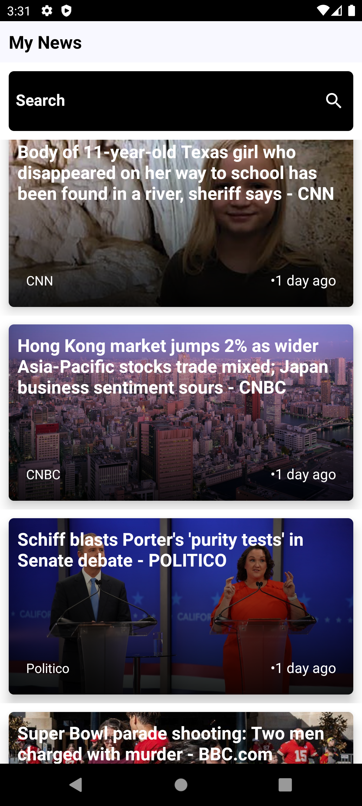

# NewsAPI-Android
 This Android app harnesses the power of the NewsAPI to deliver the latest news articles directly to your device. Stay informed and up-to-date on current events, trends, and developments with this intuitive news-fetching application.
### Features:
- **Latest News Fetching:**  Utilize the NewsAPI to fetch the most recent news articles from various sources
- **Search Functionality:**  Search for specific news topics, keywords, or articles of interest to quickly find relevant information.
- **User-Friendly Interface:**  Enjoy a sleek and intuitive user interface designed for effortless navigation and a pleasant reading experience.

### App Images

### API used :
- **News API:** https://newsapi.org/v2/
- **Joke API:** https://v2.jokeapi.dev/joke/Any
- **Trivia API:** https://jservice.io/api/random

#### Troubleshooting

- If you encounter any build errors, check that Android Studio is updated to the latest version and that all plugins and dependencies are correctly configured.
- For database connection issues, verify that XAMPP's MySQL service is running and that your database credentials are correct in the PHP backend files.

Following these steps should help you successfully set up and run the Android application.

## Contributing

Feel free to contibute to this project , you can also add new features to make it more better , Thanks ...
